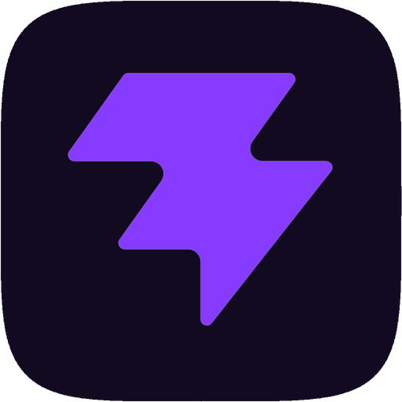

<p align="center">
  
</p>

<h1 align="center">Aura</h1>

<p align="center">
  A blazingly fast desktop music player for <a href="https://navidrome.org/">Navidrome</a> and Subsonic-compatible servers.<br>
  Lightweight. Native. Cross-platform.
</p>

<p align="center">
  <a href="https://github.com/darkw3bb/aura/releases/latest"><strong>Download Latest Release</strong></a>
</p>

<p align="center">
  <a href="https://github.com/darkw3bb/aura/releases/latest">
    
  </a>
  <a href="https://github.com/darkw3bb/aura/releases">
    
  </a>
  <a href="https://github.com/darkw3bb/aura/actions/workflows/ci.yml">
    
  </a>
  
</p>

---

## Downloads

Head to the **[Releases](https://github.com/darkw3bb/aura/releases)** page and grab the latest build for your platform:

| Platform | Architecture | What to download |
|----------|-------------|-----------------|
| macOS | Apple Silicon (M1/M2/M3/M4) | `Aura_x.x.x_aarch64.dmg` |
| macOS | Intel | `Aura_x.x.x_x64.dmg` |
| Windows | x64 | `Aura_x.x.x_x64-setup.exe` (NSIS installer) |
| Linux | x64 | `Aura_x.x.x_amd64.AppImage` or `.deb` |

> **Where are the builds?** Every tagged release triggers a GitHub Actions build across macOS, Windows, and Linux. The compiled installers are uploaded as assets to the [Releases](https://github.com/darkw3bb/aura/releases) page -- not under "Packages" (that's for container images/npm modules). Look for the **Assets** dropdown at the bottom of each release.

> **Auto-updates:** Once installed, Aura checks for new versions automatically. You'll see a banner at the top of the app when an update is available -- one click to download, install, and restart.

---

## What is this?

Aura is a desktop music player that connects to your self-hosted [Navidrome](https://navidrome.org/) (or any Subsonic API-compatible) music server. Think of it as a native, fast, privacy-respecting alternative to streaming apps -- but for your own music library.

Your music. Your server. A proper desktop app that doesn't eat 500MB of RAM.

### Why not just use the Navidrome web UI?

You absolutely can! But Aura gives you:
- **Native audio playback** -- no browser overhead, pure Rust audio engine
- **OS media key support** -- play/pause/skip from your keyboard, Control Center, or lock screen
- **Instant search** -- local SQLite cache with full-text search, results in microseconds
- **~5MB binary** -- vs ~150MB for Electron-based alternatives
- **Auto-updates** -- always on the latest version without checking a website

---

## Features

- **Instant search** -- Local SQLite + FTS5 full-text index for sub-millisecond results (Cmd/Ctrl+K)
- **Native audio engine** -- Pure Rust playback (rodio + symphonia) supporting FLAC, MP3, AAC, ALAC, OGG Vorbis, Opus, WAV, AIFF, WavPack
- **OS media controls** -- macOS Now Playing / Control Center, Windows SMTC, Linux MPRIS
- **Star ratings** -- Rate tracks 1-5 stars, synced back to your server
- **Album browser** -- Grid view with cover art and artist sidebar
- **Queue management** -- Drag-and-drop reordering, play next, add to queue
- **Genre browsing** -- Explore your library by genre
- **Keyboard-driven** -- Vim-style navigation (J/K), keyboard shortcuts for everything
- **Background library sync** -- Full metadata cached locally for offline browsing
- **Auto-updates** -- Built-in updater checks GitHub Releases for new versions
- **Cross-platform** -- macOS, Windows, Linux from a single codebase
- **Lightweight** -- Tiny binary, minimal memory footprint

---

## Keyboard Shortcuts

| Shortcut | Action |
|----------|--------|
| `J` / `K` | Move focus down / up in lists and grids |
| `Enter` | Activate focused item (open album, play track) |
| `Cmd/Ctrl + K` | Open search |
| `Cmd/Ctrl + [` | Navigate back |
| `Cmd/Ctrl + ]` | Navigate forward |
| `Space` | Play / Pause |
| `Escape` | Close search / overlay |
| Media keys | Play, Pause, Next, Previous (via OS) |

---

## Tech Stack

| Component | Technology |
|-----------|-----------|
| Framework | [Tauri 2](https://v2.tauri.app/) |
| Frontend | React 19, TypeScript, Vite |
| Styling | Tailwind CSS 4 |
| State | Zustand |
| Virtual scroll | TanStack Virtual |
| Audio | rodio + symphonia (Rust) |
| Media keys | souvlaki (Rust) |
| HTTP | reqwest (Rust) |
| Cache | SQLite + FTS5 via rusqlite |
| Async | Tokio |
| Updates | tauri-plugin-updater |

---

## Getting Started (Development)

### Prerequisites

- [Rust](https://rustup.rs/) (1.77+)
- [Node.js](https://nodejs.org/) (18+)
- A running [Navidrome](https://navidrome.org/) server (or any Subsonic API-compatible server)

#### Platform-specific

**macOS:** Xcode Command Line Tools

```bash
xcode-select --install
```

**Linux (Debian/Ubuntu):**

```bash
sudo apt install libwebkit2gtk-4.1-dev build-essential curl wget file \
  libxdo-dev libssl-dev libayatana-appindicator3-dev librsvg2-dev \
  libasound2-dev
```

**Windows:** [Microsoft C++ Build Tools](https://visualstudio.microsoft.com/visual-cpp-build-tools/)

### Run locally

```bash
git clone https://github.com/darkw3bb/aura.git
cd aura
npm install
npx tauri dev
```

On first launch, enter your Navidrome server URL, username, and password in Settings. Click **Sync Library to Local Cache** to populate the local search index.

### Build for production

```bash
npx tauri build
```

---

## Architecture

```
src-tauri/           Rust backend
  src/
    subsonic/        Subsonic/OpenSubsonic API client
    audio/           Audio playback engine (rodio + symphonia)
    cache/           SQLite metadata cache + FTS5 search
    media_controls   OS media key integration (souvlaki)
    commands         Tauri IPC command handlers

src/                 React + TypeScript frontend
  components/
    Player/          Transport bar (play/pause/skip/seek/volume)
    Library/         Album grid, artist list, cover art
    TrackList/       Infinite scroll virtual track list
    Search/          Search overlay (Cmd+K)
    Queue/           Queue panel with drag-and-drop
    Settings/        Server connection settings
    Rating/          Star rating component
  stores/            Zustand state management
  hooks/             React hooks (search, updater)
  lib/               Typed Tauri IPC wrappers
```

---

## Roadmap

- [ ] Gapless playback
- [ ] Offline mode (download tracks)
- [ ] Synced lyrics (LRCLIB)
- [ ] Last.fm / ListenBrainz scrobbling
- [ ] Audio equalizer
- [x] Vim-style keyboard navigation
- [ ] Waveform seekbar
- [ ] Mini player mode
- [ ] Multiple server support
- [ ] Smart playlists
- [ ] ReplayGain volume normalization
- [ ] Crossfade
- [ ] Theme system (dark/light/custom)

---

## Vibe Coded

This entire project was vibe coded with [Cursor](https://cursor.com/) and AI. Every line of Rust, every React component, every CSS class -- built through human-AI collaboration. No hand-wringing over architecture astronautics, just vibes and iteration.

**Contributions are very welcome!** Whether you're a human, an AI, or somewhere in between -- if you want to improve Aura, open a PR. AI-assisted contributions are not just accepted, they're encouraged. This is how software gets built now.

---

## License

[MIT](LICENSE)
